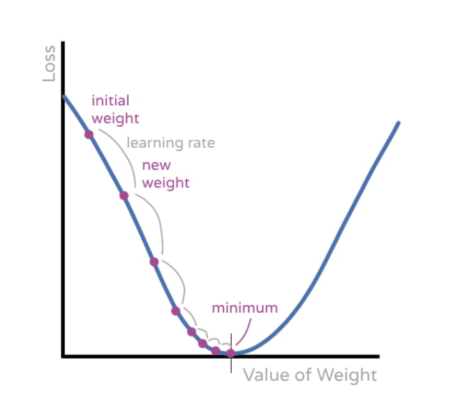

# Gradient Descent: A Complete Walkthrough

## Overview

Gradient descent is how a neuron **learns** from its mistakes. It's a loop:

```
┌─────────────────────────────────────────────────────────┐
│  1. FORWARD PASS: Make a prediction                     │
│                         ↓                               │
│  2. LOSS: Measure how wrong the prediction is           │
│                         ↓                               │
│  3. GRADIENTS: Use chain rule to find direction         │
│                         ↓                               │
│  4. UPDATE: Nudge weights to reduce loss                │
│                         ↓                               │
│  5. REPEAT until loss is small enough                   │
└─────────────────────────────────────────────────────────┘
```

---

## Notation Guide

| Symbol | Meaning |
|--------|---------|
| x₁, x₂ | Inputs (e.g., [1, 1] for AND gate) |
| w₁, w₂ | Weights (learnable parameters) |
| b | Bias (learnable parameter) |
| z | Weighted sum (before activation) |
| ŷ or output | Prediction after sigmoid |
| y or expected | True/target value |
| L | Loss (how wrong we are) |
| dL/dw | "How does L change when w changes?" (gradient) |
| η (eta) | Learning rate |

---

## Step 1: Forward Pass

Compute the prediction given current weights.

### 1a. Weighted Sum

```
z = w₁x₁ + w₂x₂ + b
```

**What it means**: Each input is multiplied by its importance (weight), then summed with bias.

**Example**:
```
Inputs:  x₁ = 1, x₂ = 1
Weights: w₁ = 0.5, w₂ = 0.5
Bias:    b = -0.2

z = (0.5)(1) + (0.5)(1) + (-0.2)
z = 0.5 + 0.5 - 0.2
z = 0.8
```

### 1b. Activation (Sigmoid)

```
output = σ(z) = 1 / (1 + e^(-z))
```

**What it means**: Squash z into a value between 0 and 1 (like a probability).

**Example**:
```
output = 1 / (1 + e^(-0.8))
output = 1 / 1.449
output ≈ 0.69
```

---

## Step 2: Loss

Measure how wrong the prediction is.

```
L = (output - expected)²
```

**What it means**: Square the difference so errors don't cancel and big errors are punished more.

**Example**:
```
output = 0.69
expected = 1.0

L = (0.69 - 1.0)²
L = (-0.31)²
L = 0.096
```

---

## Step 3: Gradients (The Chain Rule)

Find out which direction to adjust each weight.

### The Question We're Asking

> "If I change weight w₁ by a tiny amount, how much does the loss change?"

This is written as: **dL/dw₁**

### The Chain of Operations

Weights don't directly affect loss. There are steps in between:

```
w₁ → z → output → L

    [weighted    [sigmoid]   [squared
      sum]                    error]
```

The chain rule says: multiply the derivatives of each step.

```
dL/dw₁ = (dL/d_output) × (d_output/dz) × (dz/dw₁)
```

### Computing Each Piece

**Piece 1: dL/d_output**

"How does loss change when output changes?"

```
L = (output - expected)²

dL/d_output = 2(output - expected)
```

With our numbers: `2(0.69 - 1) = 2(-0.31) = -0.62`

---

**Piece 2: d_output/dz**

"How does sigmoid output change when z changes?"

The derivative of sigmoid is:

```
d_output/dz = output × (1 - output)
```

With our numbers: `0.69 × (1 - 0.69) = 0.69 × 0.31 = 0.214`

---

**Piece 3: dz/dw₁**

"How does z change when w₁ changes?"

```
z = w₁x₁ + w₂x₂ + b

dz/dw₁ = x₁  (the input!)
```

With our numbers: `x₁ = 1`

---

### Multiply the Chain Together

```
dL/dw₁ = (dL/d_output) × (d_output/dz) × (dz/dw₁)
       = (-0.62)       × (0.214)       × (1)
       = -0.133
```

### The Error Signal (Shared Computation)

Notice that Piece 1 and Piece 2 are the **same for all weights**:

```
error_signal = (output - expected) × output × (1 - output)
             = (-0.31) × 0.214
             = -0.133  (approximately, without the 2)
```

Then for each weight:
```
gradient_w₁ = error_signal × x₁
gradient_w₂ = error_signal × x₂
gradient_b  = error_signal × 1
```

This is why the chain rule is efficient: compute the shared part once, multiply by each input.

---

## Understanding the computeGradients Function

Here's the function from `neuron.py`:

```python
def computeGradients(self, inputs, output, expected): 
    error_signal = (output - expected) * output * (1 - output)
    gradient_weights = error_signal * np.array(inputs)
    gradient_bias = error_signal
    return gradient_weights, gradient_bias
```

### Line-by-Line Breakdown

**Line 1: error_signal**
```python
error_signal = (output - expected) * output * (1 - output)
```
This computes **Piece 1 × Piece 2** of the chain rule (the shared part):
- `(output - expected)` → Piece 1: How wrong is the prediction?
- `output * (1 - output)` → Piece 2: How sensitive is sigmoid at this point?

Note: The mathematical formula has a `2` in Piece 1, but we drop it because it just scales the learning rate.

**Line 2: gradient_weights**
```python
gradient_weights = error_signal * np.array(inputs)
```
This multiplies the shared error_signal by **each input** (Piece 3 for each weight):
- NumPy broadcasting: one number × array = element-wise multiplication
- Result is an array with one gradient per weight

**Line 3: gradient_bias**
```python
gradient_bias = error_signal
```
For the bias, Piece 3 is just `1` (since `dz/db = 1`), so:
- `gradient_bias = error_signal × 1 = error_signal`

---

## gradient_weights vs gradient_bias: Key Differences

### Why They're Different

| Parameter | In the equation | Piece 3 (dz/d?) | Gradient formula |
|-----------|-----------------|-----------------|------------------|
| Weight wᵢ | `z = wᵢ × xᵢ + ...` | `dz/dwᵢ = xᵢ` | `error_signal × xᵢ` |
| Bias b | `z = ... + b` | `dz/db = 1` | `error_signal × 1` |

The key insight: **weights are multiplied by inputs, bias is just added**.

### Example with Different Inputs

```
error_signal = -0.066
inputs = [1, 0.5]    # x₁ = 1, x₂ = 0.5
```

**gradient_weights:**
```python
gradient_weights = -0.066 * [1, 0.5]
                 = [-0.066, -0.033]
                      ↑        ↑
                     w₁       w₂ (smaller because x₂ was smaller)
```

**gradient_bias:**
```python
gradient_bias = -0.066    # Always just error_signal
```

### When Input is Zero

```
inputs = [1, 0]     # x₂ contributed nothing to output
```

```python
gradient_weights = -0.066 * [1, 0]
                 = [-0.066, 0.0]
                      ↑      ↑
                     w₁     w₂ gets NO update (didn't contribute!)
```

The bias still gets updated because it always contributes to z.

### Summary Table

| Aspect | gradient_weights | gradient_bias |
|--------|------------------|---------------|
| Type | Array (one per weight) | Single number |
| Formula | `error_signal × inputs` | `error_signal` |
| Depends on inputs? | Yes - scaled by each xᵢ | No - always the same |
| If input = 0 | That weight's gradient = 0 | Still gets updated |
| Intuition | "Blame weights by contribution" | "Bias always contributes" |

### Visual

```
                    error_signal = -0.066 (shared)
                           │
           ┌───────────────┼───────────────┐
           │               │               │
           ▼               ▼               ▼
        × x₁ (=1)      × x₂ (=0.5)      × 1
           │               │               │
           ▼               ▼               ▼
    grad_w₁ = -0.066  grad_w₂ = -0.033  grad_b = -0.066
    
    gradient_weights = [-0.066, -0.033]   gradient_bias = -0.066
```

---

## Step 4: Update Weights

Move weights in the direction that reduces loss.

```
w_new = w_old - η × gradient
```

**What it means**:
- Subtract because gradient points toward HIGHER loss (we want lower)
- η (learning rate) controls step size

**Example**:
```
η = 0.5
gradient_w₁ = -0.133

w₁_new = 0.5 - (0.5)(-0.133)
w₁_new = 0.5 + 0.067
w₁_new = 0.567
```

The weight increased because the gradient was negative (meaning: increasing the weight decreases the loss).

---

## Interpreting the Gradient Sign

| Gradient | Meaning | Update Action |
|----------|---------|---------------|
| Positive (+) | Increasing weight → increases loss | Decrease weight |
| Negative (-) | Increasing weight → decreases loss | Increase weight |
| Zero (0) | At minimum (or maximum) | No change needed |

---

## Visual: The Landscape

## Complete Flow Diagram

```
                    FORWARD PASS →
    
    x₁ ──┬──→ ×w₁ ──┐
         │          │
         │          ├──→ Σ+b ──→ z ──→ sigmoid ──→ output ──→ loss
         │          │                                           │
    x₂ ──┴──→ ×w₂ ──┘                                          │
                                                                │
                    ← BACKWARD PASS (chain rule)                │
                                                                │
    grad_w₁ = x₁ × error_signal ←───────────────────────────────┤
                                                                │
    grad_w₂ = x₂ × error_signal ←───────────────────────────────┤
                                                                │
    grad_b  = 1  × error_signal ←───────────────────────────────┘
    
    where: error_signal = (output - expected) × output × (1 - output)
```

---

## Summary: The Equations

### Forward Pass
```
z = Σ(wᵢxᵢ) + b          Weighted sum
output = σ(z)             Activation (sigmoid)
```

### Loss
```
L = (output - expected)²  Squared error
```

### Gradients (Chain Rule)
```
error_signal = (output - expected) × output × (1 - output)

∂L/∂wᵢ = error_signal × xᵢ    For each weight
∂L/∂b  = error_signal         For bias
```

### Update
```
wᵢ = wᵢ - η × ∂L/∂wᵢ      For each weight
b  = b  - η × ∂L/∂b       For bias
```

---

## Why This Works

1. **Loss** tells us how wrong we are
2. **Gradients** tell us which direction makes it worse
3. **Subtracting** gradients moves us toward less wrong
4. **Repeat** until we reach minimum loss

The chain rule lets us compute all gradients efficiently by reusing shared computations. This scales from 3 parameters to billions.
