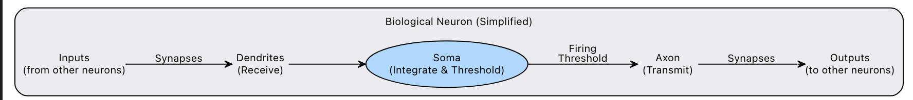

# Neurons

## Biological Neurons

### What is a neuron



A neuron is a biological structure that receives electrochemical inputs from other neurons through dendrites and produces outputs through axons. These outputs are also electrochemical signals that are passed as inputs to other neurons. Signals are integrated in the cell body (soma), similar to the weighted sum + bias in an artificial neuron.

Electrochemical signals are the primary way neurons communicate, but they are not the only dimension; we also have neuromodulators, hormones, and glial cells.

[The biological inspiration](https://apxml.com/courses/introduction-to-neural-networks/chapter-1-neural-network-foundations/artificial-neurons)


## Artificial Neurons

### What is an artificial neuron

An artificial neuron is a mathematical function: a simplified version of what a biological neuron does. It takes input signals, processes them, and produces a **single** output signal.

If interested in the differences between ANNs and BNNs, read: [Difference between ANN and BNN](https://www.geeksforgeeks.org/machine-learning/difference-between-ann-and-bnn/)

Maybe we can get some ideas for translating/implementing elements of a BNN into an ANN. 


### Components

#### Inputs

Inputs are the raw data we feed into the neuron. They are represented as an array of numbers:

- **Image**: pixel values like [0.2, 0.5, 0.9, ...] where each number is a pixel's brightness (0 = black, 1 = white)
- **Weather prediction**: sensor readings like [temperature, humidity, pressure] = [22.5, 0.65, 1013]
- **Logic gates**: binary inputs like [0, 1] or [1, 1]

Each input gets its own weight, so the array sizes must match: 3 inputs : 3 weights.

#### Weights

Weights determine how much importance each input has. These values are crucial for learning, we modify them based on how much we are "losing" when we calculate the outputs.

#### Bias

A bias helps the activation function decide whether or not to fire the neuron. It shifts the z value before it goes into the activation function. 

You might wonder why do we need a bias? what does it mean?
Imagine this example: 

Inputs = [0,0]

Weights = [0.5, 0.5]

Bias = - 0.7

**Without bias:**

We compute z as $z = W_1 * X_1 + W_2 * X_2$ 

$z = (0.5 * 0) + (0.5 * 0) = 0$

If we pass 0 into our sigmoid function: $sigmoid(0) = 1 / (1 + e^0) = 1 / (1 + 1) = 0.5$

The output is exactly in the middle — the neuron is undecided. For an AND gate, we need [0,0] to output 0 (don't fire), but we're getting 0.5.

**With bias = -0.7:**

Now z includes the bias: $z = W_1 * X_1 + W_2 * X_2 + b$

$z = (0.5 * 0) + (0.5 * 0) + (-0.7) = -0.7$

$sigmoid(-0.7) \approx 0.33$

Now the output leans toward 0 (don't fire). The bias shifted the decision — it raised the bar for what counts as "enough evidence to fire."

[Read more about weights and biases](https://apxml.com/courses/introduction-to-neural-networks/chapter-1-neural-network-foundations/weights-and-biases)


### Forward Pass

The forward pass computes the neuron's output. After defining our weights and biases:

1. **Compute the weighted sum:**

$z = w \cdot x + b$

2. **Apply the activation function** to make the output non-linear:


The weighted sum z is a linear operation. Even a complex neural network using only linear operations would behave like a simple linear regression model. By applying an activation function, we introduce non-linearity, enabling the neuron to learn complex patterns. 

### Why Activation Matters (Non-linearity)

Try drawing a straight line that separates an XOR x,y plot — you can't! This is why non-linear activation functions are essential.

[Learn more about activation functions](https://www.geeksforgeeks.org/machine-learning/activation-functions-neural-networks/)


### Artificial Neuron Flow Overview


With that, we have a basic neuron. To summarize:

1. Take inputs $X_i$, multiply them by their corresponding weights $W_i$, and add a bias (which sets the threshold for how much evidence the neuron needs before firing)
2. Transform the output z into a non-linear version through an activation function


## Learning

Learning is the process of modifying our learnable parameters repeatedly until we reach a point where we are satisfied with the output of our loss function. The loss function measures how close our predictions are to the actual expected output.

We have three learnable parameters:
- **Weights (w₁, w₂)**: how much importance each input has on the output
- **Bias (b)**: how easily or reluctantly the neuron fires

Before we start learning we need a way to calculate how close we are getting to the real output. This is the **loss function**.

We take the network's output and compare it to the real value. The result is a value representing the "error" or "loss" of those predictions.

Our goal in training is to **minimize this loss value**.

### Loss Function

We use squared error: `L = (output - expected)²`

Why square it?
- Errors don't cancel out (no negative values)
- Big errors get punished more than small ones
- Smooth curve that works well with calculus

### What is a Gradient?

A gradient answers a simple question: 

> "If I increase this weight by a tiny amount, how much does the loss change?"

- **Positive gradient**: Increasing the weight makes loss go UP → decrease the weight
- **Negative gradient**: Increasing the weight makes loss go DOWN → increase the weight
- **Zero gradient**: You're at a minimum → no change needed

### The Chain Rule

We can't directly ask "how does changing w₁ affect the loss?" because there are steps in between:

```
w₁ → z → output → Loss
```

The **chain rule** says: multiply the derivatives of each step:

```
dL/dw₁ = (dL/d_output) × (d_output/dz) × (dz/dw₁)
            Piece 1         Piece 2        Piece 3
```

- **Piece 1**: How wrong is the prediction? `(output - expected)`
- **Piece 2**: How sensitive is sigmoid? `output × (1 - output)`
- **Piece 3**: How much did this weight contribute? `xᵢ` (the input)

### The Error Signal (Efficiency)

Piece 1 and Piece 2 are the **same for all weights**. We compute them once:

```python
error_signal = (output - expected) * output * (1 - output)
```

Then multiply by each input for each weight's gradient:

```python
gradient_weights = error_signal * inputs    # [error_signal × x₁, error_signal × x₂]
gradient_bias = error_signal                # error_signal × 1 (bias has no input)
```

### Why gradient_weights and gradient_bias Are Different

| Parameter | Formula | Why |
|-----------|---------|-----|
| Weight wᵢ | `error_signal × xᵢ` | Scaled by how much that input contributed |
| Bias b | `error_signal × 1` | Always contributes equally (just added, not multiplied) |

If an input was 0, that weight gets no update — it didn't contribute to the error!

### Updating Parameters (Gradient Descent)

Once we have gradients, we update parameters to reduce loss:

```python
weights = weights - learning_rate × gradient_weights
bias = bias - learning_rate × gradient_bias
```

**Why subtract?** The gradient points "uphill" (toward higher loss). We want to go "downhill" (lower loss), so we go the opposite direction.

### Learning Rate

The learning rate controls step size:

| Learning Rate | Effect |
|---------------|--------|
| Too large (1.0+) | Overshoots minimum, bounces around |
| Too small (0.001) | Very slow convergence |
| Just right (0.1-0.5) | Smooth convergence |

### The Training Loop

One complete training cycle:

```
1. FORWARD PASS → Make prediction with current weights
2. LOSS → Measure how wrong we are
3. GRADIENTS → Use chain rule to find direction to improve
4. UPDATE → Nudge weights/bias to reduce loss
5. REPEAT for all training examples (one epoch)
6. REPEAT for many epochs until loss is small
```

---
**For detailed explanations with step-by-step calculations, see [gradient_descent_explained.md](gradient_descent_explained.md)**